# 2024-2025-4GP - Projet Capteur low-tech Graphite - Aliénor Jarry et Bastien Maïs

## Sommaire :
- [Contexte](#contexte)
- [Livrables](#livrables)
- [Matériel nécessaire](#matériel-nécessaire)
- [1. Simulation électronique du capteur sous LTSpice](#1-simulation-électronique-du-capteur-sous-ltspice)
- [2. Design du PCB sous KiCad](#2-design-du-pcb-sous-kicad)
- [3. Réalisation du Shield](#3-réalisation-du-shield)
- [4. Code Arduino](#4-code-arduino)
- [5. Application Android APK sous MIT App Inventor](#5-application-android-apk-sous-mit-app-inventor)
- [6. Banc de test](#6-banc-de-test)
- [7. Datasheet du capteur](#7-datasheet-du-capteur)
- [Conclusion](#conclusion)
- [Contacts](#contacts)

## Contexte
Dans le cadre de l'UF "Du capteur au banc de test en open source hardware" se déroulant lors de notre 4ème année Génie Physique à l'INSA de Toulouse, nous avons développé un capteur à jauge de contrainte low-tech à base de crayon graphite. Ce projet repose sur le rapport scientfique "Pencil Drawn Strain Gauges and Chemiresistors on Paper", publié en 2014 par Cheng-Wei Lin*, Zhibo Zhao*, Jaemyung Kim & Jiaxing Huang.

Le capteur se compose uniquement d'un morceau de papier sur laquelle une trace de crayon à papier dépose une fine couche de graphite. Un dépôt de graphite sur du papier constitue un système granulaire, où des grains de tailles variables sont séparés par une distance appelée distance inter-grain. La conductance du système varie de manière exponentielle en fonction de cette ditance, laquelle peut être ajustée en déformant le papier. Ainsi, la contrainte exercée sur le matériau peut être déterminée en mesurant simplement la résistance aux bornes du capteur.

L'objectif est de concevoir un dispositif permettant la mesure de déformation à partir d'un capteur low-tech, puis d'évaluer ses performances en le comparant à un capteur commercial.

## Livrables
- Un Shield PCB branchée sur une carte Arduino UNO, intégrant un capteur graphite, un amplificateur de transimpédance et un module Bluetooth. Idéalement, il incluerait également un écran OLED, un encodeur rotatif, un potentiomètre numérique (remplaçant la résistance R2 dans le circuit amplificateur), ainsi qu'un connecteur pour un servomoteur et un capteur de flexion (afin de comparer ses mesures avec celles du capteur en graphite).
- Un code Arduino garantissant la gestion de tous les composants et l'acquisition des mesures (mesures de contrainte, échanges via Bluetooth, affichage OLED, encodeur rotatif, potentiomètre numérique et servomoteur).
- Une application APK Android qui gère l'interface entre le PCB et le code Arduino. L'application doit au minimum afficher la valeur de la résistance de la jauge de contrainte ainsi que sa variation relative sur le smartphone.
- Un code Arduino dédié au banc de test pour la mesure de la jauge de contrainte.
- Une datasheet du capteur en graphite (incluant le circuit de transimpédance).

## Matériel nécessaire
Pour concevoir notre dispositif électronique, voici la liste des composants nécessaires :
- Des résistances : 1 de 1 kΩ, 1 de 10 kΩ, 2 de 100 kΩ pour l'amplificateur transimpédance. 1 de 47 kΩ pour le flex sensor (capteur commercial)
- Des condensateurs : 2 de 100 nF et 1 de 1 μF pour l'amplificateur transimpédance. 1 de 100 nF pour l'encodeur rotatif
- Un amplificateur opérationnel LTC1050
- Un potentiomère numérique MCP41050
- Une carte Arduino UNO
- Un module Bluetooth HC05
- Un écran OLED 128×64
- Un encodeur rotatif
- Un servomoteur
- Un flex sensor
- Un morceau de papier et crayon pour la fabrication du capteur graphite

## 1. Simulation électronique du capteur sous LTSpice

Notre capteur graphite présente une résistance variable de l’ordre du gigaohm (GΩ). Lorsque une tension de 5V est appliquée à ses bornes, un courant extrêmement faible est généré, de l’ordre de 100 nA en moyenne.

Un tel signal est difficilement exploitable sans amplification. Pour y remédier, nous avons utilisé un montage transimpédance basé sur un amplificateur opérationnel (AOP). Ce montage permet de convertir ce courant en une tension suffisamment élevée pour être lue par le convertisseur analogique-numérique (ADC) d’une carte Arduino UNO. 

**Nous avons simulé ce montage à l’aide du logiciel LTspice, voici notre schéma du circuit analogique** : 
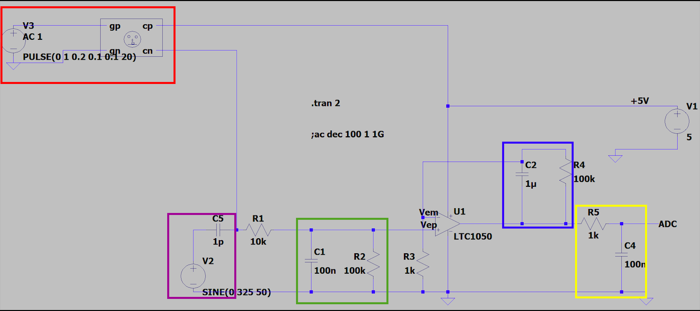

Nous avons choisi l'AOP LTC1050 car il est adapté pour traiter de très faibles courants d'entrée. Son faible offset de tension assure une conversion précise du courant en tension.

**Deux éléments de simulation sont intégrés au circuit** :

- 🟥 Simulation du capteur  
- 🟪 Simulation du bruit

De plus, des filtres ont été ajoutés au montage afin d'atténuer les perturbations indésirables (par ex : bruits d'alimentation à 50 Hz) 

**Trois filtres assurant le traitement du signal** :

- 🟩 Filtre en entrée de l'AOP(R2, C1) :  
 C'est un filtre passe-bas passif de fréquence de coupure fc = 16 Hz. Il filtre les bruits en courant sur le signal d'entrée.

- 🟦Filtre couplé à l'AOP (R4, C2) :  
  C'est un filtre passe-bas actif avec fc = 1,6 Hz. Il filtre la composante du bruit à 50Hz du réseau électrique.

- 🟨 Filtre en sortie de l'AOP (R5, C4) :  
  C'est un filtre passe-bas passif avec fc = 1,6 kHz. Il élimine les parasites générés lors du traitement du signal.

De plus, la résistance R1 en entrée protège contre les décharges électrostatiques. Cette résistance en combinaison avec la capacité C5, forme un filtre pour atténuer les bruits de tension. 

**Voici la réponse de notre circuit afin de vérifier que le capteur est bien amplifié** :
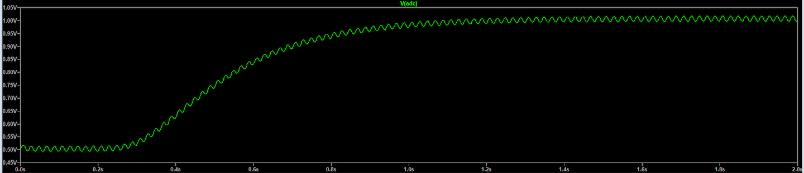
Nous voyons que le signal est amplifié à 1V. Ainsi, l'Arduino UNO pourra le mesurer. 

**Réponse avec un courant alternatif pour vérifier que le bruit est bien filtré** :
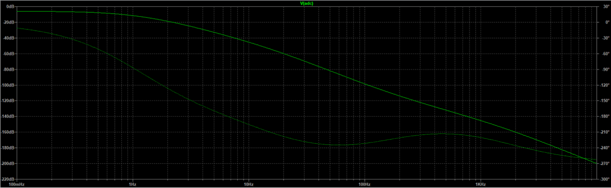
Nous remarquons que le bruit est bien atténué à 50 Hz, d'environ 72 dB.

## 2. Design du PCB sous KiCad

Notre PCB a été conçue sur le logigiel Kicad (version 9).

Nous avons tout d'abord réalisé la schématique en reproduisant le circuit transimpédance (en enlevant la partie simulant le bruit). Nous avons  remplacé la résistance R3 par un potentiomètre digital. Cela nous permet d'ajuster le gain de notre AOP en fonctions de nos besoins. Également, nous avons créé les symboles des différents composants/modules intégrés. Ces modules assureront une mesure précise de notre capteur en graphite et permettra de comparer les résultats obtenus.

**Voici le schéma électrique de l'ensemble de notre montage** :
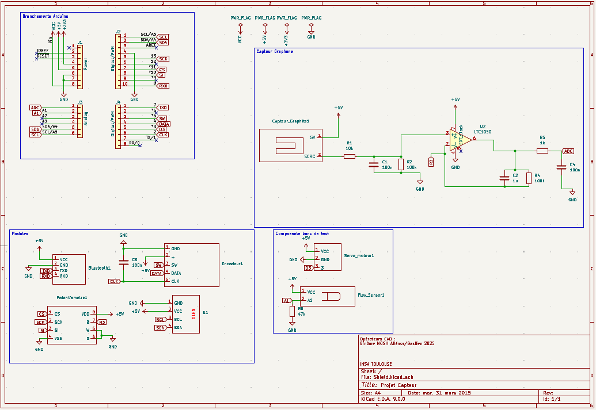

Ensuite, nous avons réalisé les empreintes de nos composants en prenant en compte leurs caractéristiques techniques : nombre de pins, espacement, dimensions, géométrie,...
afin de les placer sur notre PCB. 

Puis, nous sommes allés dans l'onglet "éditeur de PCB" sous Kicad pour designer notre circuit. Nous nous sommes appuyés sur un modèle de carte Arduino Uno. Nous avons ainsi placé nos différents composants, de manière à regouper les composants du circuit transmpédance. De plus les modules, et les composants du circuit transimpédance devaient être placés proches de leurs branchements Arduino respectifs. Nous sommes ensuite passés à la partie routage du circuit. Notre principale difficulté a été d’optimiser le placement des composants afin de limiter au maximum l’utilisation de vias, notamment pour les connexions au GND. Nous avons tout de même trois vias sur notre PCB. Pour garantir une bonne connexion entre toutes les broches GND des composants, nous avons mis en place un plan de masse.

**Voici le résultat final obtenu de notre routage** : 
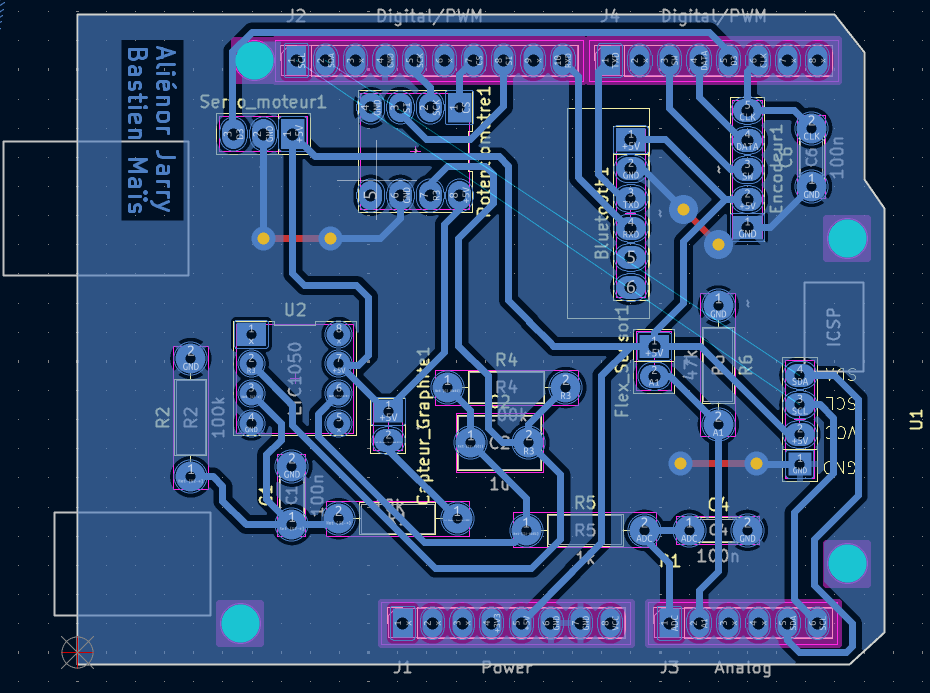

**Voici le rendu 3D de notre PCB, avec ses différents modules et composants intégrés**:
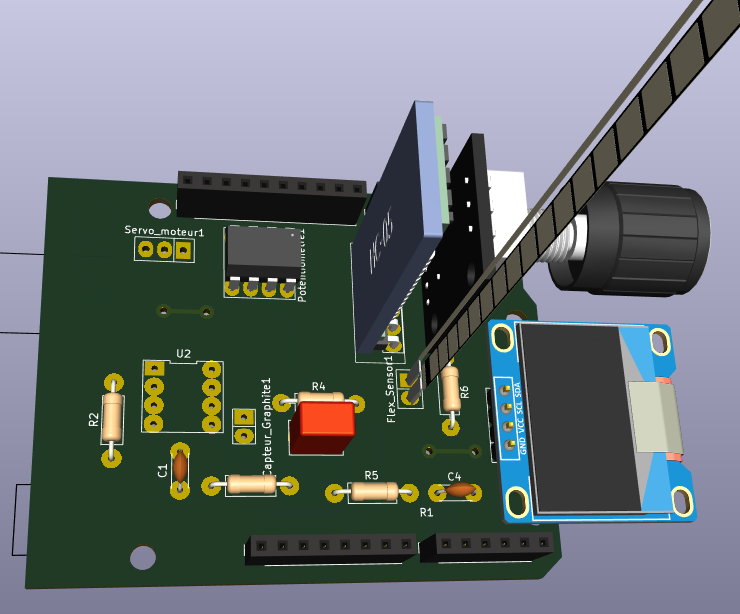

Toutes les ressources utilisées pour notre Kicad (empreintes, schéma etc...) sont disponibles dans notre dossier Kicad.

### **Erreurs réalisées** : 

Nous avons fait quelques erreurs concernant les empreintes de nos modules.

**Servomoteur** :
Nous avons inversé les broches GND et 5V. 

**Bluetooth HC-05** : 
L'empreinte de notre Bluetooth n'est pas correcte. Nous avions mis dans l'ordre la broche VCC, GND, TX, RX, ENABLE et STATE alors que la broche ENABLE est la première. Voici les broches correctes du Bluetooth :

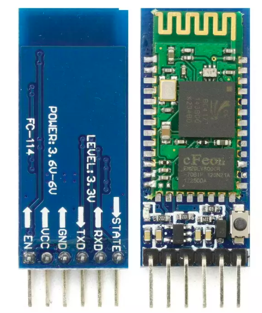

Un conseil serait de se baser sur la datasheet de chaques composant afin de réaliser les empreintes! De plus, il faut faire attention concerant les broches TX et RX du Bluetooth. La broche RX de la carte Arduino doit être raccordée à la broche TX du Bluetooth, et la broche TX du Arduino à la broche RX du Bluetooth.
Nous avons résolu le problème des pins Bluetooth en utilisant des connecteur mâles, femelles permettant de brancher correctement le Bluetooth.

## 3. Réalisation du Shield 

Une fois notre PCB finalisé sous KiCad, nous l’avons envoyé à Cathy afin qu’elle puisse vérifier que le PCB était conforme et prête pour une impression correcte. Puis, nous avons généré le masque de gravure de notre PCB que Cathy s’est chargée d’imprimer. Ensuite, nous sommes allées avec Cathy au GEI afin de tirer notre PCB.

Nous n’avons pas pu manipuler directement, mais nous avons tout de même pu observer le processus de fabrication de la carte. Cathy a procédé ainsi :

1. Insolation UV de la plaque en époxy recouverte d'une fine couche de cuivre (destinée à recevoir le circuit imprimé) et d'une résine photosensible, à travers le masque, pour durcir la résine dans les zones exposées.
2. Développement : la plaque est plongée dans un révélateur pour éliminer la résine non exposée à la lumière UV, laissant ainsi un motif de résine durcie correspondant au circuit imprimé.
3. Gravure : La plaque est ensuite immergée dans un bain de perchlorure de fer, qui dissout le cuivre non protégé par la résine durcie, formant ainsi les pistes du circuit imprimé.
4. Nettoyage à l’acétone pour éliminer les résidus de résine restants après la gravure.

**Voici une photo du masque de gravure et une photo de notre PCB une fois imprimé** :

  
  

**Nous tenions à grandement remercier Cathy pour son aide tout au long du projet, et en particulier pour l'impression de notre PCB.**

### Assemblage du circuit :

Nous avons ensuite procédé au perçage de la plaquette pour permettre l'insertion des différents composants, en veillant à respecter la taille des trous. Un forêt plus petit était nécessaire pour les résistances et les condensateurs. Une fois le perçage effectué, nous avons soudé les composants sur le PCB. Il faut bien faire attention à souder uniquement sur les pastilles, sauf pour les pastilles GND où un débordement est moins problématique, car elles sont toutes reliées au plan de masse. Un excès de soudure sur les pastilles pourrait en effet créer des courts-circuits. De plus, nous avons dû ajouter un fil reliant la broche 5V du flex sensor au 5V du module Bluetooth, car une portion de cuivre sur la piste les reliant a été retirée accidentellement en tentant d’enlever un surplus de soudure.

**Voici une photo de l'assemblage de notre circuit (sans les modules) ainsi qu'une photo de nos soudures** :

  
  

## 4. Code Arduino 

Afin de réaliser le code arduino nous avons utilisé l'IDE 2.3.2.

Dans le cadre d'une utilisation d'application mobile nous avons donc utilisé un module bluetooth. Cela a ainsi necessité d'inclure la librairie SoftwareSerial pour initier la communication entre l'application et le pcb via le module.

Pour une utilisation plus classique de notre montage, l'écran OLED permet l'affichage des valeurs issues des mesures de capteurs de la plaquette impliquant l'utilisation de la librairie Adafruit_SSD1306. Cette librairie est plus délicate à manipuler car gourmande en mémoire RAM. Pour parier cet effet, il nous est impératif de limiter l'affichage au strict nécessaire afin de contrôler l'utilisation de la RAM et d'éviter d'éventuels disfonctionnements du programme.

Dans le dossier Arduino se trouve le programme complet strucuré qui permet de faire différents types de mesures selon le capteur utilisé (graphite ou flex sensor). Lors du lancement de l'Arduino, le programme effectue une calibration du potentiomètre digitale selon la valeur mesurée par le capteur graphite pour ensuite affichée un menu déroulant que l'on peut balayer à l'aide de l'encodeur rotatoir.

Le menu affiche 3 choix d'actions possibles : 

- Une mesure instantanée du capteur graphite toutes les 500ms
- Une mesure du flex sensor toutes les 500ms
- Une calibration du potentiomètre digital

  
  

Pour sélectionner une action du menu, il suffit de tourner la molette et d'appuyer sur le bouton central de l'encodeur. Si l'on souhaite sortir d'une action du menu, nous tournons simplement la molette de l'encodeur.

Ainsi on obtient la résistance du capteur graphite avec la formule suivante :

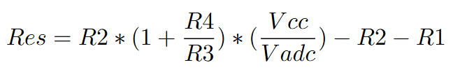

Et dans notre cas, notre résistance R3 est variable : elle est issue du réglage du potentiomètreà l'aide d'un méthode de dichotomie.

Finalement, nous n'avons pas utilisé le servomoteur comme module par manque de temps

## 5. Application Android APK sous MIT App Inventor
Comme mentionné dans la partie précèdente, une application mobile a été réalisée sous MIT App Inventor.
L'application reçoit les données transmis par le module bluetooth HC-05. Elle affiche ensuite la valeur tranmis (des Mohms)
pour le capteur graphite ou des ohms pour le flex sensor.

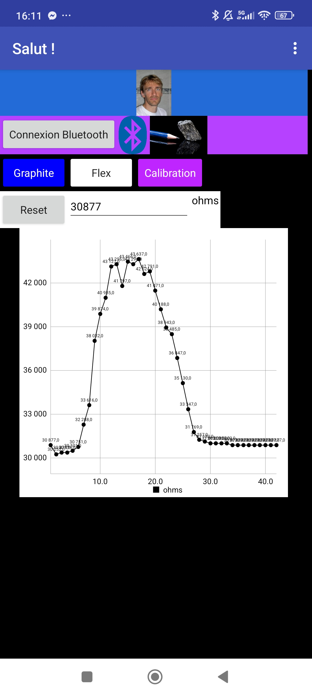

  
  

## 6. Banc de test
Pour spécifier notre capteur graphite et son montage transimpédance, nous avons utilisé le banc de test fabriqué par le binôme Maëlys et Arthur. Un grand merci à eux pour nous avoir prêter leur banc de test. Ce banc de test comporte des demis-cercles avec des diamètres différents allant de 2cm à 4,5cm avec un rajout de 0,5cm entre chaque demi-cercles. Au total, il y a 6 demi-cercles. Ce banc de test comporte des encoches pour chaque demi-cercle qui permet d'insérer facilement le capteur. Une fois le capteur mis dans l'une de ses encoches, il est plus aisé d'appliquer une traction ou une compression sur le capteur. La capteur se déforme en suivant la courbure du demi-cercle. Ainsi, nous appliquons une contrainte qui provoque une variation de la résistance du capteur. Nous allons mesurer cette contrainte en fonction de la déformation.

La variation relative de la résistance se définit par : ΔR/R0 (avec R0 la résistance initiale du capteur avant sa déformation et ΔR la variation de la résistance après et avant déformation). La déformation est : ε=e/D (avec e=0,2mm l'épaisseur du papier utilisé et D le diamètre du demi-cercle). Nous avons donc une déformation variant de 0.01 pour le plus petit diamètre à 0.004 pour le plus grand. Il faut faire attention de bien mettre les diamètres des demi-cercles en mm! 

**Voici le banc de test que nous avons utilisé :**

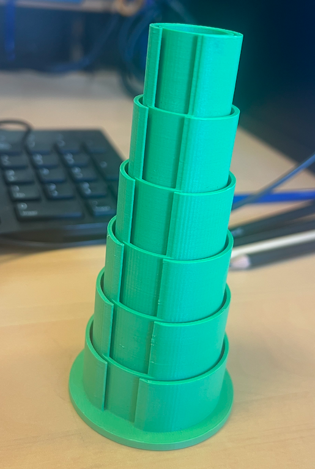

### Voici les courbes caractéristiques pour des crayons F, HB et B en flexion et en compression :

  
  

### Voici le graphe comparant le Flex Sensor et le capteur Graphite pour F, HB et B (en tension) :
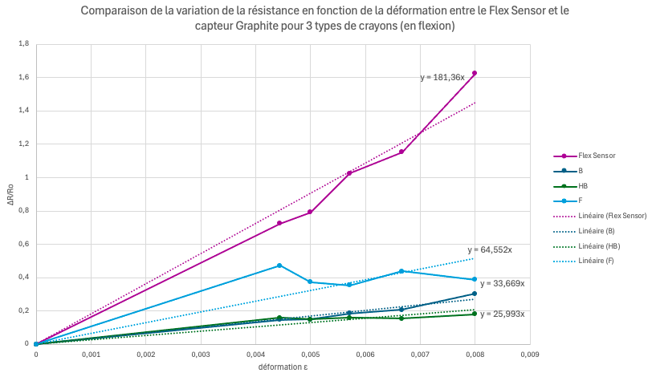

 On remarque que la résistance augmente lorsque l'on met le capteur en tension et qu'elle diminue lors de la compression de ce dernier. En tension, la distance entre les atomes de carbones augmente et la résistance augmente avec. Le contraire se produit pour la compression.
 En fonction de la dureté du crayon utilisé, les variations relatives de résistance changent. Plus le crayon est gras (2H->H->HB->B->2B avec 2B avec le plus de carbone), moins sa variation relative de résistance est élevée.

 
De plus, contrairement, à l'article "Pencil Drawn Strain Gauges and Chemiresistors on Paper" (Cheng-Wei Lin*, Zhibo Zhao*, Jaemyung Kim & Jiaxing Huang), nous avons pu mesurer la résistance avec un crayon 2H.

Enfin, on peut comparer notre capteur avec un flex sensor commercial. Il semblerait que le flex sensor soit plus sensible à la déformation, en plus d'être plus solide pour des déformations importantes. Pour notre capteur, il a un nombre d'utilisation très limité, qui diminue très fortement pour une déformation élevée.

Néanmoins, toutes ces mesures sont à prendre avec du recul au vu des conditions non reproductibles d'essai. En effet, la quantité de graphite déposée au crayon à papier est très variable, induisant ainsi une résistance très variable. Il serait intéressant de développer une méthode afin de déposer une quantité fixe et reproductible de graphite.       Egalement, nous conseillerons de changer de banc de test et d'utiliser un servo-moteur qui permet de créer des conditions plus reproductibles, que ce soit pour le carbone qui n'est pas déposé sur le banc de test mais également par l'angle imposé qui est précisement connu. Autrement, il faudrait reproduire des cercles de diamètres connues mais avec des déformations moins importantes afin de moins endommager le capteur.

Les courbes montrent que le flex sensor présente une variation relative de résistance nettement plus marquée que nos capteurs en graphite.

Capteur Flex sensor : pente ≈ 237,36
Capteur graphite HB : pente ≈ 43,5
Capteur graphite H : pente ≈ 34,6
Capteur graphite 3B : pente ≈ 20,3
Le capteur Flex est donc beaucoup plus sensible à la déformation. Sa réponse est plus régulière, linéaire et plus exploitable en conditions réelles.

En théorie, lorsque le capteur est soumis en tension, la monocouche de graphite déposée sur le papier s’étire, ce qui augmente la distance entre les atomes de carbone. Cette augmentation de distance entraîne une hausse de la résistance du capteur. À l’inverse, lorsqu’il est soumis à une compression, les atomes de carbone se rapprochent, ce qui réduit la résistance du capteur. La variation relative de résistance dépend également du type de crayon utilisé pour tracer la couche de graphite. Plus le crayon est gras (par exemple, du H vers le HB jusqu’au 3B, qui contient le plus de carbone), plus la variation relative de résistance est faible. Bien que la théorie prévoie une augmentation de la résistance en tension et une diminution en compression, nos résultats expérimentaux ne suivent pas totalement cette tendance attendue :
Compression

Sur la courbe de compression, on observe bien une diminution de la résistance relative ( \Delta R / R_0 ) lorsque la déformation augmente.
En revanche, le graphite 3B, censé avoir une plus faible variation relative en théorie (car moins conducteur), présente ici la plus grande variation de résistance.

Extension

En tension, les résultats montrent bien une augmentation de la résistance avec la déformation. Cependant, contrairement à la théorie, le crayon HB présente ici la variation la plus élevée, suivi du H, tandis que le 3B varie beaucoup moins. Cela contredit l’idée selon laquelle les crayons les plus dures (ici H) varient le plus.

Interprétation

En effet, plusieurs facteurs influencent le comportement réel du capteur :

L’uniformité du dépôt de graphite sur le capteur.
La qualité des crayons
Le contact électrique entre le graphite et les pinces.
Comparaison entre le capteur graphite et le capteur Flex sensor commercial

Nous avons comparé les performances de notre capteur graphite artisanal à un capteur flex commercial. La comparaison s’appuie sur les résultats expérimentaux obtenus en extension :

## 7. Datasheet du capteur

## Conclusion

## Contacts
Aliénor Jarry : [ajarry@insa-toulouse.fr](mailto:ajarry@insa-toulouse.fr)  
Bastien Maïs : [mais@insa-toulouse.fr](mailto:mais@insa-toulouse.fr)  
